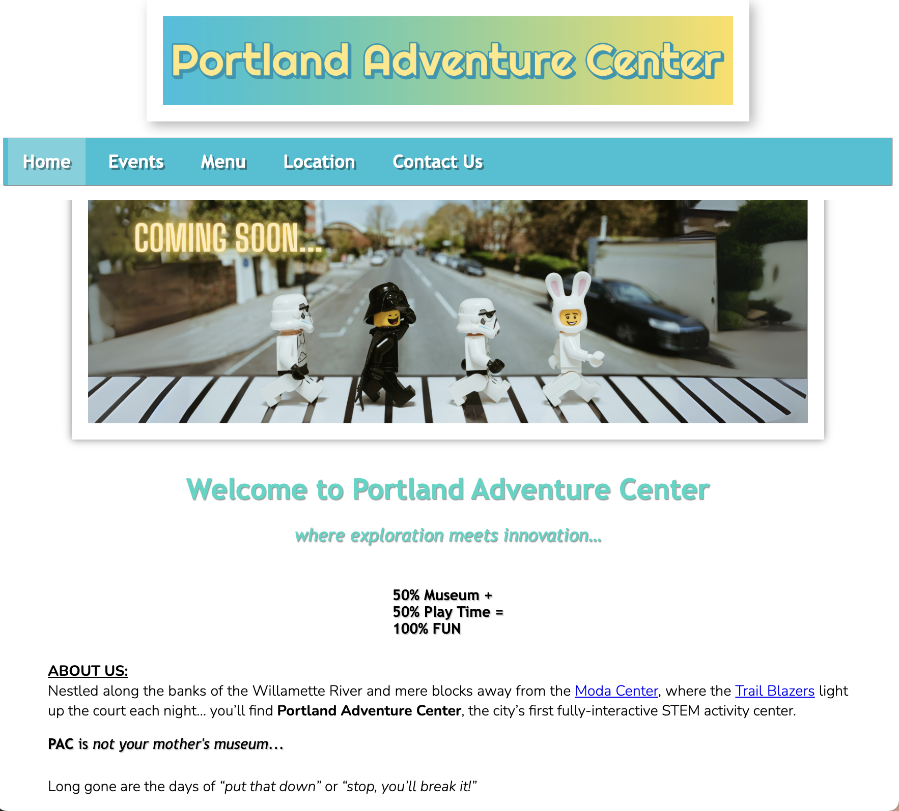
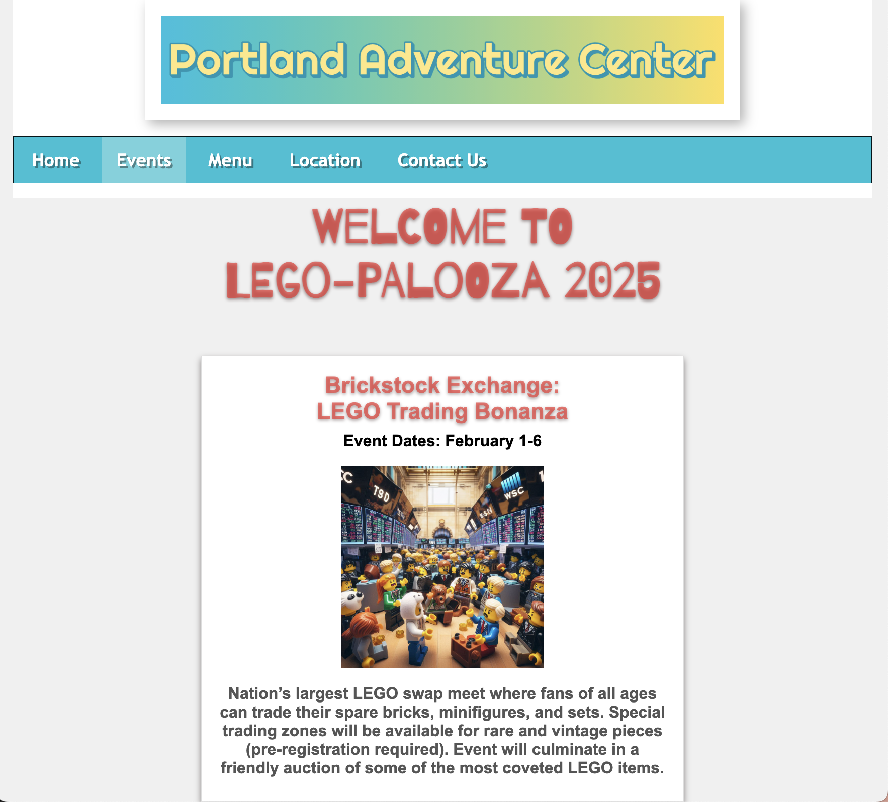
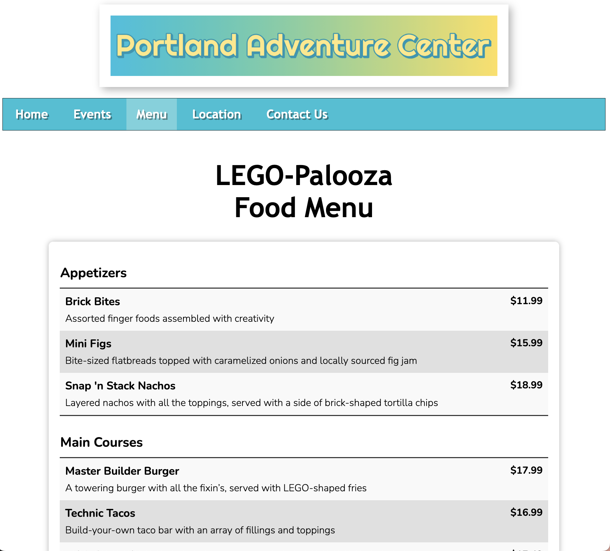
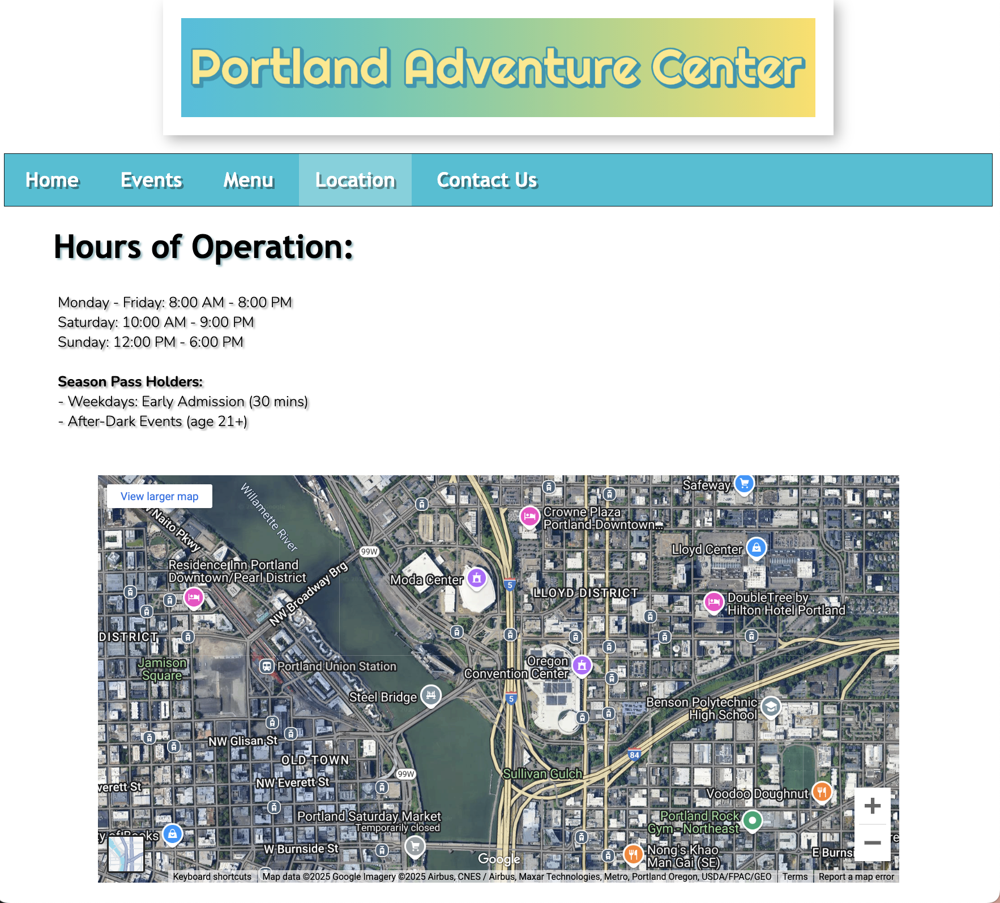
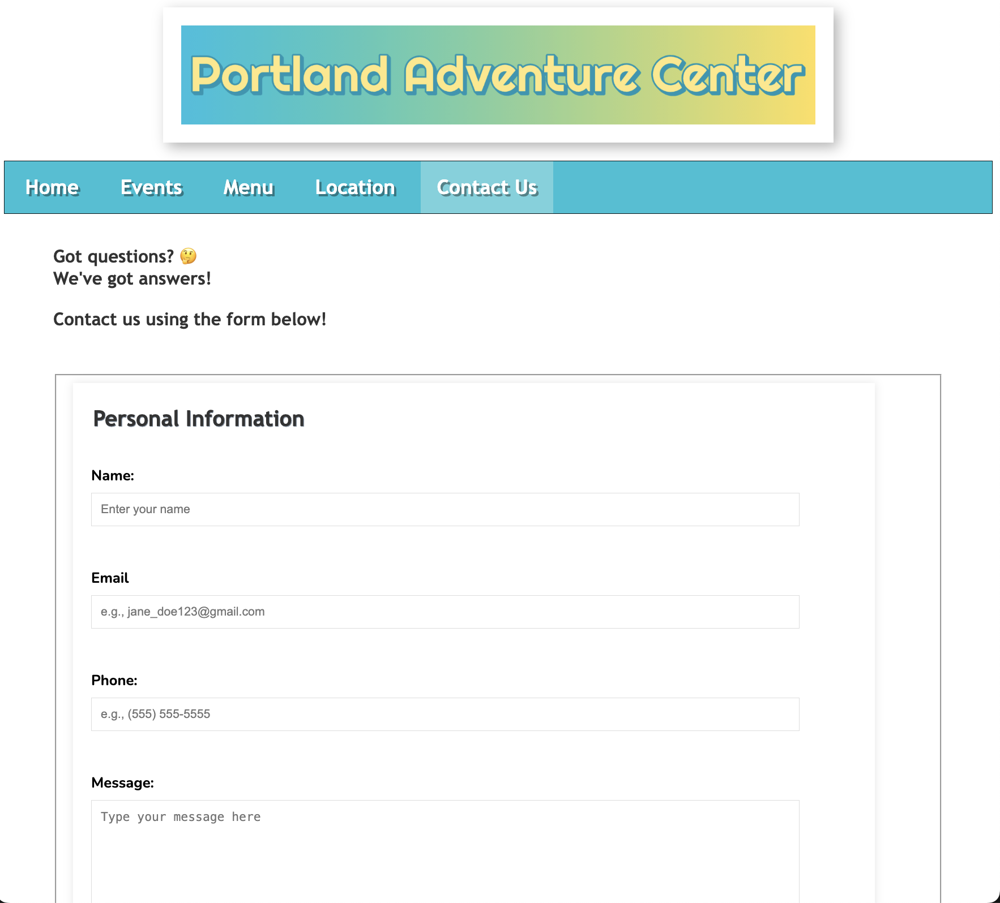

# Portland Adventure Center

## Home of LEGO-Palooza 2025

## Table of Contents

- [Portland Adventure Center](#portland-adventure-center)
  - [Home of LEGO-Palooza 2025](#home-of-lego-palooza-2025)
  - [Table of Contents](#table-of-contents)
  - [Introduction](#introduction)
  - [Features](#features)
  - [Installation](#installation)
  - [Prerequisites](#prerequisites)
  - [Usage](#usage)
  - [Screenshots](#screenshots)
    - [Home Page](#home-page)
    - [Events Page](#events-page)
    - [Menu Page](#menu-page)
    - [Location Page](#location-page)
    - [Contact Us Page](#contact-us-page)
  - [Authors](#authors)

## Introduction

Welcome to the Portland Adventure Center!

This project is a multi-page website that was designed for an imaginary event center located in Portland, OR to help showcase the front-end development skills we've learned throughout Module 4 of the Software Development bootcamp at [Coding Temple](https://www.codingtemple.com).

This ficticious site features the Portland Adventure Center, home of LEGO-Palooza 2025, a [LEGO](https://www.lego.com)-themed event for the month of February. It includes detailed information about the events, as well as the center itself and the various activities and services offered.

While LEGO-Palooza is "Technic-ally" an entirely made up event, it really shouldn't be... 😉

## Features

- Home page with an introduction to the event center
- Detailed event page for LEGO-Palooza 2025
- Food menu page with categorized and LEGO-themed items and prices
- Location page with directions and hours
- Contact Us page with a contact form
- Responsive design for mobile and desktop

## Installation

To get started with the Event Center PDX website, follow these steps:

1. Clone the repository:

   ```bash
   git clone https://github.com/jenplanque/event_site_portland.git

   cd event_site_portland
   ```

2. Open the project in your preferred code editor (e.g., Visual Studio Code).

3. Open the [index.html](http://_vscodecontentref_/1) file in your web browser to view the website.

## Prerequisites

Before you begin, ensure you have met the following requirements:

- A web browser (e.g., Google Chrome, Firefox, Safari)
- A code editor (e.g., Visual Studio Code, Sublime Text)

## Usage

To use the Event Center PDX website, follow these steps:

1. Open the [index.html](http://_vscodecontentref_/2) file in your web browser.
2. Navigate through the different pages using the navigation bar.
3. Explore the event details, food menu, location information, and contact form.

## Screenshots

### Home Page



### Events Page



### Menu Page



### Location Page



### Contact Us Page



## Authors

This project was created by:

- [Jen Planque](https://github.com/jenplanque)
